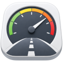

# DrivePulse




⚠️ **AI-assisted project**
> **⚠ Under active development — not ready for production use.**
> Features, configuration and data formats may change at any time without notice.

OBD-II dashboard built on GTK4 / libadwaita. Connects to an OBD-Device and reads vehicle data via the OBD-II interface. GPS speed is read in parallel via GeoClue2 or GPSD.

---

## Screenshots


---

## Features

- Multiple dashboard themes (Analog, Cockpit, Digital, Modern, Neon, Racing, Sport)
- **Acceleration measurement**
  - G-force ball display with real-time longitudinal and lateral G
  - 0–30 / 0–50 / 0–70 / 0–100 / … / 0–200 km/h and 100–200 km/h from OBD and GPS
  - Vmax elapsed times (OBD / GPS / average) shown at end of run
  - replay completed runs with real-time animation
- **Cars / Trips page**
  - lists all vehicles seen, with recorded trips
  - OBD scan history and acceleration runs per vehicle
  - trip detail includes speed/RPM/G chart + map track
  - Acceleration runs stored per vehicle (date, GPS location, all split times, G-force peaks)
- **Device sync**
  - transfer the full database between two devices over a local Wi-Fi connection
  - server generates a QR code, client scans it in local networks; TLS-encrypted
- Settings: units (km/h / mph), language (English / German), gauge theme, mock mode toggle

---

## Requirements

### System

```bash
sudo apt install python3-gi gir1.2-gtk-4.0 gir1.2-adw-1 gir1.2-webkit-6.0 python3-pip
python3 -m pip install --user obd
```

### GPS

DrivePulse supports two GPS sources simultaneously:

| Source | How it works |
|---|---|
| **GeoClue2** | D-Bus system service — the standard on Linux phones (Phosh / Mobian). No setup required, the system provides it. |
| **GPSD** | TCP socket on `localhost:2947` — common on desktop Linux with an external GPS receiver. |

Both sources are tried automatically on startup. Whichever delivers a fix first lights the GPS indicator green. If neither is available the indicator stays grey.

---

## Running

```bash
python3 drivepulse.py
```

---

## Installation (desktop integration)

```bash
bash install.sh
```

Installs the icon and `.desktop` file to `~/.local/share/` so DrivePulse appears in the application menu.

```bash
bash uninstall.sh   # to remove
```

---

## Project structure

```
drivepulse.py              Launcher (imports drivepulse_app.app)
drivepulse_app/
  app.py                   Application entry point (Adw.Application subclass)
  app_settings.py          Load / save persistent user settings (JSON)
  common.py                Shared constants and utility functions
  translations.py          Translation catalog (EN / DE) and _translate helper
  diagnostics.py           Logging helpers

  dashboard_window.py      Main application window (Adw.ApplicationWindow)
  dashboard_layout.py      Responsive gauge layout mixin (portrait / landscape)
  dashboard_settings.py    Settings callbacks mixin
  dashboard_telemetry.py   OBD + GPS payload dispatch mixin
  dashboard_data.py        DashData dataclass used by dashboard themes
  dashboard.py             Dashboard canvas and theme dispatcher

  gauge.py                 Circular gauge widget (Cairo)
  draw_helpers.py          Shared Cairo drawing utilities

  acceleration.py          Acceleration measurement page (GTK widget)
  acceleration_canvas.py   G-force ball canvas widget
  acceleration_processing.py  Payload processing mixin (timing, G logic)
  acceleration_replay.py   Run replay mixin

  cars.py                  Vehicles / trips / scans / acceleration runs page
  cars_layout.py           Cars page layout mixin (sidebar / detail split)
  cars_detail_render.py    Car detail content renderer
  cars_metadata.py         OBD PID catalogue and category definitions
  cars_profiles.py         OBD profile loader
  cars_actions.py          Car CRUD actions (rename, delete)
  cars_trips.py            Trip list and detail widgets
  cars_trip_widgets.py     Trip detail chart + map widget
  cars_trip_visuals.py     Trip chart drawing helpers
  cars_scans.py            Scan list and detail widgets
  cars_scan_widgets.py     Scan detail widget
  cars_accel_runs.py       Acceleration run list and detail widgets

  db.py                    SQLite storage (cars, trips, samples, scans, acceleration_runs)
  trip_recorder.py         Ongoing trip recording logic

  obd_reader.py            OBD connection manager (real + mock)
  obd_polling.py           OBD polling loop
  obd_scanner.py           Full OBD scan (PIDs, DTCs, identity)
  obd_devices.py           ELM327 device detection
  mock_obd.py              Mock OBD simulator for development
  bluetooth_bridge.py      Bluetooth RFCOMM helper

  gps_reader.py            GeoClue2 + GPSD reader
  orientation_reader.py    Accelerometer sensor reader (g-force data)

  sync_dialog.py           Sync UI (server / client flow, QR display)
  sync_server.py           HTTPS sync server (TLS, port auto-select 8765+)
  sync_client.py           Sync client (TLS, certificate pinning)
  sync_flow.py             Pairing URL parsing and sync protocol
  sync_data.py             Database export / import and paired-device registry
  sync_crypto.py           TLS key-pair generation, SPKI fingerprint, token helpers
  sync_identity.py         Persistent device identity (ID + certificate paths)
  sync_qrgen.py            Pure-Python QR code generator (SVG → GdkPixbuf)
  sync_qr_scanner.py       Webcam QR scanner via GStreamer + zxing

  settings_dialog.py       Settings UI (Adw.PreferencesDialog)
  icon_registry.py         Bundled SVG icon registration
  startup_info.py          Python package dependency checker
  telemetry_utils.py       Telemetry helpers

themes/
  analog.py                Analog halfmoon dashboard theme
  cockpit.py               Cockpit theme
  digital.py               Digital theme
  modern.py                Modern gauge theme
  neon.py                  Neon theme
  racing.py                Racing theme
  sport.py                 Sport theme
icons/
  hicolor/symbolic/actions/  SVG icons (currentColor, 16×16)
icons.gresource.xml        GResource manifest
icons.gresource            Compiled icon bundle
```

### DashData variables (used by dashboard themes)

| Field | Type | Source | Description |
|---|---|---|---|
| `speed_kmh` | `float\|None` | OBD/GPS | Current speed (km/h) |
| `obd_speed_kmh` | `float\|None` | OBD | Speed from OBD sensor |
| `gps_speed_kmh` | `float\|None` | GPS | Speed from GPS |
| `speed_active` | `bool` | — | Speed value is live |
| `speed_label` | `str` | — | Formatted speed string |
| `rpm` | `float\|None` | OBD | Engine RPM |
| `rpm_active` | `bool` | — | RPM is live |
| `rpm_label` | `str` | — | Formatted RPM string |
| `coolant_c` | `float\|None` | OBD | Coolant temperature (°C) |
| `coolant_active` | `bool` | — | Coolant value is live |
| `coolant_label` | `str` | — | Formatted temperature string |
| `fuel_pct` | `float\|None` | OBD | Fuel level (%) |
| `fuel_active` | `bool` | — | Fuel value is live |
| `fuel_label` | `str` | — | Formatted fuel string |
| `voltage_v` | `float\|None` | OBD | Battery/adapter voltage (V) |
| `voltage_active` | `bool` | — | Voltage value is live |
| `voltage_label` | `str` | — | Formatted voltage string |
| `throttle_pct` | `float\|None` | OBD | Throttle position (%) |
| `engine_load` | `float\|None` | OBD | Engine load (%) |
| `heading_deg` | `float\|None` | GPS | Compass heading (°) |
| `gps_lat` | `float\|None` | GPS | Latitude |
| `gps_lon` | `float\|None` | GPS | Longitude |
| `gps_altitude_m` | `float\|None` | GPS | Altitude (m) |
| `acceleration_g` | `float\|None` | OBD | Longitudinal acceleration (g) |
| `source_label` | `str` | — | Speed source indicator ("OBD" / "GPS") |
| `language` | `str` | — | Active UI language ("en" / "de") |
| `units` | `str` | — | Speed unit ("km/h" / "mph") |

---

## Database schema

SQLite file at `~/.local/share/DrivePulse/drivepulse.db`:

| Table | Contents |
|---|---|
| `cars` | One row per vehicle (identified by VIN or OBD profile path) |
| `trips` | One row per recorded drive, linked to a car |
| `samples` | ~1–2 Hz telemetry points (OBD + GPS merged), linked to a trip |
| `scans` | Full OBD scan snapshots with PIDs and DTCs, linked to a car |
| `acceleration_runs` | Completed acceleration measurement runs with split times and GPS position, linked to a car |

---

## Tests

```bash
python -m pytest tests/
```

---

## License

MIT — see [LICENSE](LICENSE).
