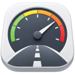
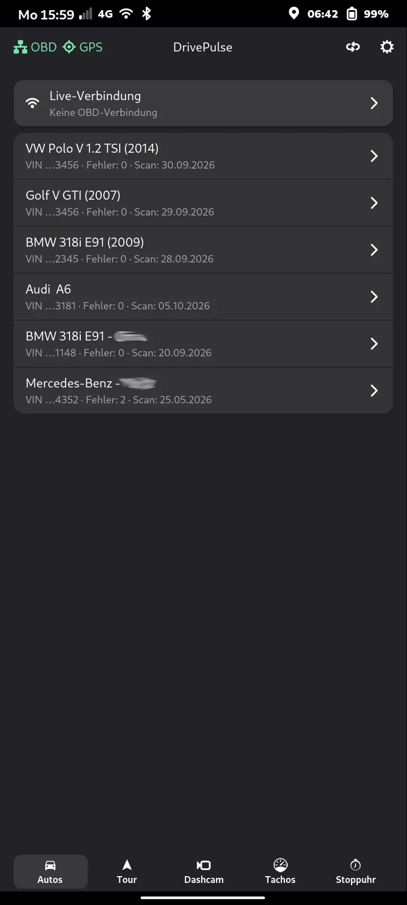
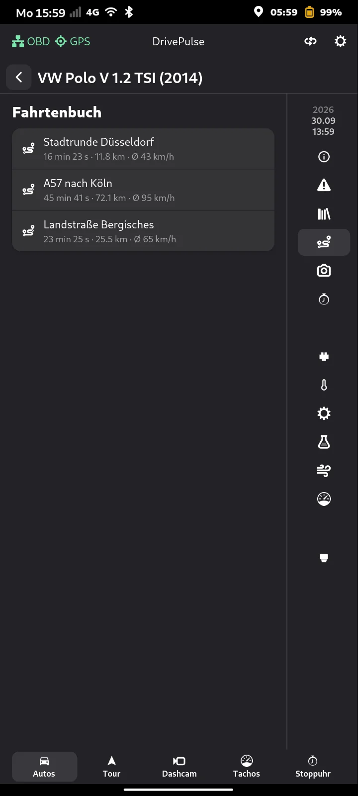
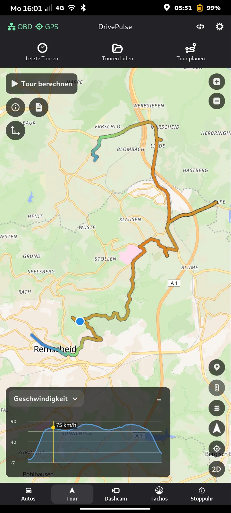
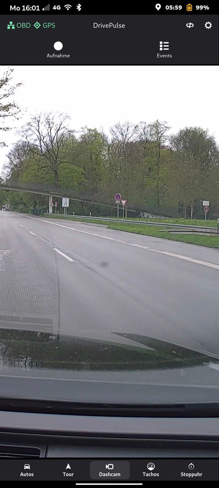
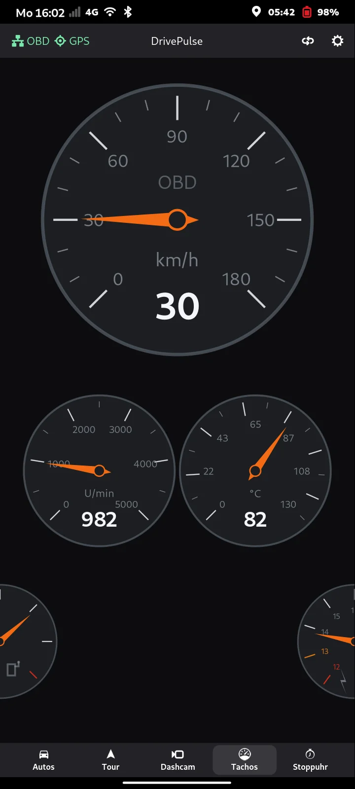
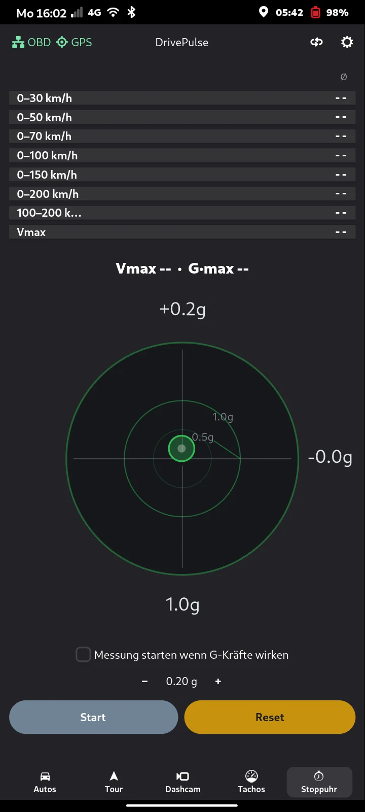
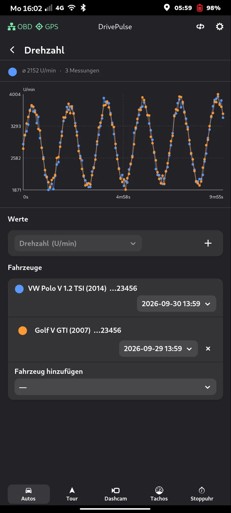

# DrivePulse



---
⚠️ **AI-assisted project**  
Under active development. Features, configuration and data formats may change without notice — not production-ready.

---

DrivePulse turns a Linux device into an in-car companion. Plug in an OBD-II adapter, optionally pair a GPS receiver and a webcam, and the same app gives you a live dashboard, navigation, dashcam, performance meter and trip log — without sending anything to the cloud.

It is designed to feel at home on a Linux phone (Phosh, Mobian) just as much as on a tablet or laptop: the UI adapts to portrait or landscape, day or night, real driving or replay. Trips, scans and runs live in a local SQLite file; two of your own devices can hand the database back and forth directly over local Wi-Fi using a QR-coded pairing.

---

## Screenshots


---

## What's inside

- **Dashboard** — multiple gauge themes in light and dark, responsive to portrait/landscape.
- **Trip log** — every drive recorded as a track with speed, RPM, G-force and map; any trip can be reopened as a tour on the map.
- **Background recording** — an optional systemd user service (`drivepulse-recorder`) records drives without the app open: it briefly checks the dongle every 2 minutes, and immediately on charging, unlock or car Bluetooth connect.
- **Performance meter** — acceleration runs (0–100, 100–200 and similar) with split times, a live G-force ball, and replay.
- **Navigation** — address search, multi-waypoint car routing, turn-by-turn with optional voice (adjustable announcement lead time), automatic rerouting, tour progress that survives a restart, tour import from GPX, KML, KMZ, GeoJSON and CSV, 2D/3D maps (OpenFreeMap, with offline fallback) and a traffic layer (German Autobahn reports and closures, affected sections coloured on the road, plus live congestion for Cologne and Bonn).
- **Dashcam** — rolling-buffer recording with one-tap event save and optional GPS/speed overlay.
- **Vehicle library** — your cars with OBD scan history, photos and per-car run records. Scans include a health snapshot (Mode 06 test results, readiness monitors, permanent DTCs, IUMPR) and can be compared over time in a zoomable chart. VIN data can be completed via NHTSA vPIC, auto.dev or vindecoder.eu.
- **OBD dongles** — ELM327-compatible adapters over Bluetooth or serial, including STN chips (e.g. OBDLink MX+) with batched multi-frame queries. Nearby search, pairing (including legacy-PIN ELM clones) and Bluetooth self-repair on Linux phones are handled in the app.
- **Car Lab** — read-only UDS exploration per car: discover control modules (identification DIDs, VAG coding), then find functions by capturing a module baseline, toggling something in the car and recording the changed byte/bit. Findings build up a per-car coding table. Nothing is ever written to the vehicle. Hidden by default — create an empty `carlab.enabled` file in the state directory to unlock it.
- **Device sync** — direct phone-to-laptop database transfer over local Wi-Fi via QR pairing, TLS-encrypted.
- **Settings** — units, language (EN/DE), gauge theme, mock-mode for development without hardware.

---

## Requirements

### Required packages

```bash
sudo apt install \
  python3-gi python3-cairo \
  gir1.2-gtk-4.0 gir1.2-adw-1 gir1.2-gdkpixbuf-2.0 \
  python3-pip

pip install --user pyserial requests cryptography
```

### Optional packages

| Package | Install | Used for |
|---|---|---|
| `gir1.2-webkit-6.0` | `sudo apt install gir1.2-webkit-6.0` | Vector/3D maps (preferred) |
| `gir1.2-shumate-1.0` | `sudo apt install gir1.2-shumate-1.0` | Raster maps (fallback) |
| `gir1.2-gstreamer-1.0` | `sudo apt install gir1.2-gstreamer-1.0` | Dashcam & QR scanner |
| `espeak-ng` | `sudo apt install espeak-ng` | Voice navigation (simple, always works) |
| `piper-tts` | `pip install --user piper-tts` | Voice navigation (natural neural voices, recommended) |
| `alsa-utils` | `sudo apt install alsa-utils` | Audio playback for piper (`aplay`) |
| `obd` (python-OBD) | `pip install --user 'drivepulse[obd]'` | Richer PID/protocol coverage — preferred when present, otherwise the GPL-free native ELM327 backend is used |

> For maps to work, at least one of WebKit 6 or Shumate must be installed. Voice guidance stays silent if neither espeak-ng nor piper is found.
> `python-OBD` (GPL v2) is optional and never bundled; without it DrivePulse drives the dongle through its own native ELM327 backend.

### GPS

DrivePulse supports two GPS sources simultaneously:

| Source | How it works |
|---|---|
| **GeoClue2** | D-Bus system service — the standard on Linux phones (Phosh / Mobian). No setup required, the system provides it. |
| **GPSD** | TCP socket on `localhost:2947` — common on desktop Linux with an external GPS receiver. |

Both sources are tried automatically on startup. Whichever delivers a fix first lights the GPS indicator green. If neither is available the indicator stays grey.

---

## Running

```bash
python3 -m drivepulse_app.app
```

After `pip install .` the same entry is also available as the `drivepulse` command.

Background recording runs as a separate process (`python3 -m drivepulse_app.service`); the settings toggle installs and enables the `drivepulse-recorder.service` systemd user unit for you.

---

## Installation (desktop integration)

```bash
bash scripts/install.sh
```

Installs the icon and `.desktop` file to `~/.local/share/` so DrivePulse appears in the application menu.

```bash
bash scripts/uninstall.sh   # to remove
```

---

## Project structure

```
drivepulse_app/
  app.py              Entry point (Adw.Application, `python3 -m drivepulse_app.app`)
  app_settings.py     Persistent user settings (JSON)
  common.py, translations.py, diagnostics.py, http_client.py, credentials.py,
  startup_info.py, updater.py, telemetry_utils.py, trip_recorder.py

  dashboard/          Main window, gauge canvas + DashData, responsive layout,
                      telemetry dispatch, theming, nav routing
  cars/               Vehicle library: trips, scans, scan stats, photos, run
                      records, VIN flow, sharing, live session, Car Lab
  chart/              Scan comparison chart
  map/                Navigation page, WebKit (MapLibre GL) and Shumate backends,
                      routing, geocoding, tour pipeline/progress/reroute/TTS,
                      speed zones, traffic layer, tour import, replay
  dashcam/            Dashcam page and segmented loop recorder
  stopwatch/          Performance meter: canvas, processing, replay
  obd/                Connection manager, polling, scanner, native ELM327/STN
                      adapter, UDS, coding diff, Bluetooth stack repair, pairing
                      agent, device detection, mock simulator
  sensors/            GPS (GeoClue2 + GPSD), accelerometer, rotation, Bluetooth
  service/            Background recorder daemon, dongle probe, systemd unit
  db/                 SQLite storage split per domain (cars, trips, samples,
                      scans, photos, tours, discoveries, sync)
  sync/               Device sync: TLS server/client, pairing, QR generator/scanner
  share/              Share protocol and UI flow
  settings/           Preferences dialog and subpages (OBD dongle, dashcam,
                      TTS, VIN decoder, updates)
  tts/                Text-to-speech service (espeak-ng / piper)
  vin/                VIN data lookup and review dialogs
  ui/                 Gauge widget, Cairo helpers, rotated/scaled containers, icons
  mock/               Mock tour simulator and demo data seed

themes/               Dashboard themes (analog, cockpit, digital, modern, neon,
                      racing, sport — each with a light variant) plus template
icons/                App icon, GResource bundle, symbolic SVG icons
lang/                 UI strings (en.json, de.json)
scripts/              Desktop installer, Bluetooth fix helpers, UDS exploration
tests/                pytest suite
```

### DashData variables (used by dashboard themes)

Each value comes as a group of `<name>` (float), `<name>_label` (formatted string) and `<name>_active` (value is live):

| Group | Source | Description |
|---|---|---|
| `rpm` (+ `rpm_max`) | OBD | Engine RPM and scale maximum |
| `speed` (+ `speed_unit`, `speed_max`, `speed_source`) | OBD/GPS | Displayed speed, unit, scale maximum, "OBD"/"GPS" |
| `coolant` (+ `coolant_min`, `coolant_max`) | OBD | Coolant temperature (°C) |
| `fuel_pct` | OBD | Fuel level (%) |
| `throttle_pct` | OBD | Throttle position (%) |
| `engine_load_pct` | OBD | Engine load (%) |
| `intake_c` | OBD | Intake air temperature (°C) |
| `maf_gps` | OBD | Mass air flow (g/s) |
| `voltage_v` | OBD | Battery/adapter voltage (V) |
| `accel_g` | OBD/sensor | Longitudinal acceleration (g) |
| `heading_deg` (+ `heading_str`) | GPS | Compass heading |

Further fields:

| Field | Description |
|---|---|
| `obd_speed`, `gps_speed` (+ `_active`) | Raw speed per source |
| `gps_lat`, `gps_lon`, `gps_altitude_m`, `gps_pos_active` | GPS position |
| `last_trip_*` | Last trip / live session stats (RPM/coolant min/max, top speed, distance, duration) |
| `scan_available`, `scan_pids`, `scan_info`, `scan_dtcs`, `scan_pending_dtcs` | Latest scan: PIDs by 4-char code, identity (VIN, brand, protocol, Cal-ID, CVN), trouble codes |
| `language` | Active UI language ("en" / "de") |

---

## Database schema

SQLite file at `~/.local/state/drivepulse/drives.sqlite3` by default
(`OBD_LOG_DIR` can override the base directory):

| Table | Contents |
|---|---|
| `cars` | One row per vehicle (identified by VIN or OBD profile path) |
| `trips` | One row per recorded drive, linked to a car |
| `samples` | ~1–2 Hz telemetry points (OBD + GPS merged), linked to a trip |
| `scans` | Full OBD scan snapshots with PIDs, DTCs and health snapshot, linked to a car |
| `scan_samples` | Time series of PID values recorded during a scan (scan comparison chart) |
| `car_photos` | Vehicle photos, linked to a car |
| `saved_tours` | Saved and imported tours (waypoints and route) |
| `share_conflicts` | Records that collided during a share/sync import, kept for review |
| `acceleration_runs` | Completed acceleration measurement runs with split times and GPS position, linked to a car |
| `scanned_modules` | Control modules a scan found present on a car (name + tx/rx addresses) — gates the Car Lab views |
| `module_discoveries` | Car Lab module-discovery inventories (which DIDs answered, identification strings, DTCs), linked to a car |
| `coding_findings` | Car Lab reverse-engineered coding bytes/bits with the user's description, linked to a car |

---

## Tests

```bash
python -m pytest tests/
```

---

## License

PolyForm Noncommercial 1.0.0 — see [LICENSE](LICENSE). Free for any
noncommercial purpose (personal use, hobby projects, education, research,
nonprofit and government use); commercial use requires a separate license
from the copyright holder.

Note: `python-OBD` (GPL v2) is an **optional** dependency
(`pip install drivepulse[obd]`), preferred when present but never bundled — it
is the only GPL **library** DrivePulse would link into its own process, which
is what would impose copyleft on the combined work. Without it, DrivePulse uses
its own GPL-free native ELM327 backend, so distributable builds (e.g. the
Flatpak) stay clear of GPL copyleft under this noncommercial license. The GPL
**command-line tools** DrivePulse can use (eSpeak NG, `v4l2-ctl`) are invoked
arm's-length as separate processes and impose no copyleft. See
[CREDITS.md](CREDITS.md) for all third-party licenses and attributions.
